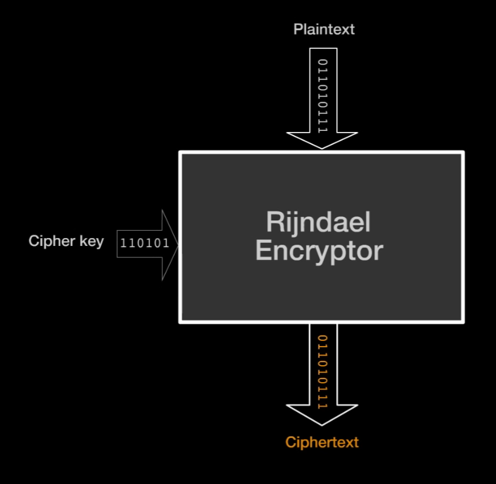
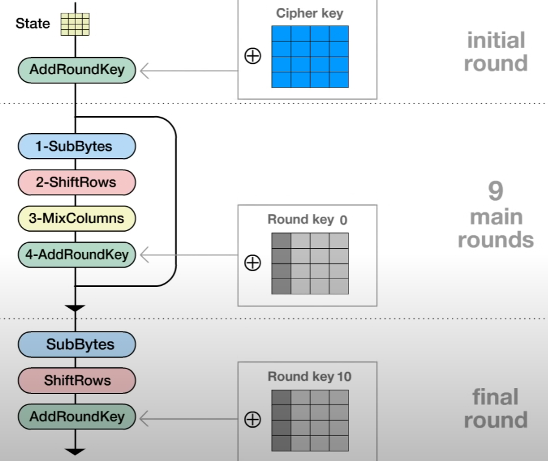
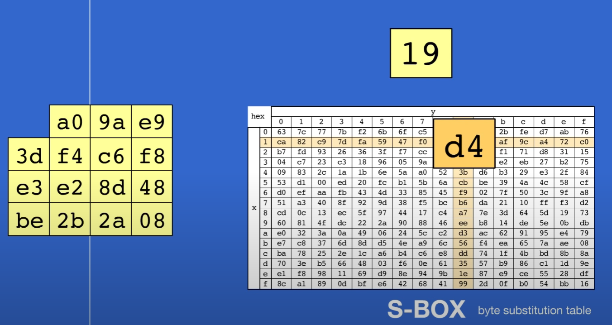
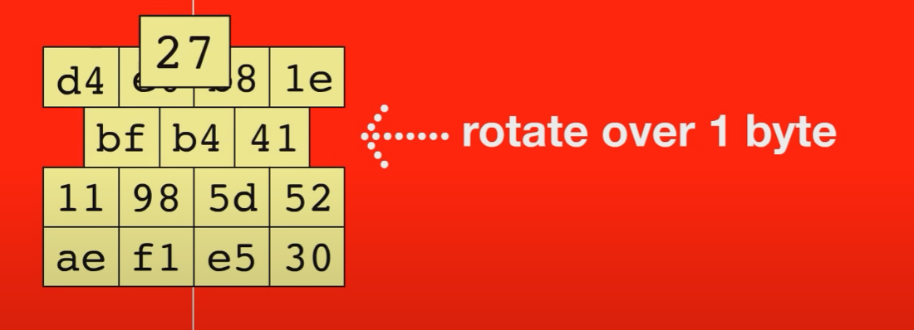
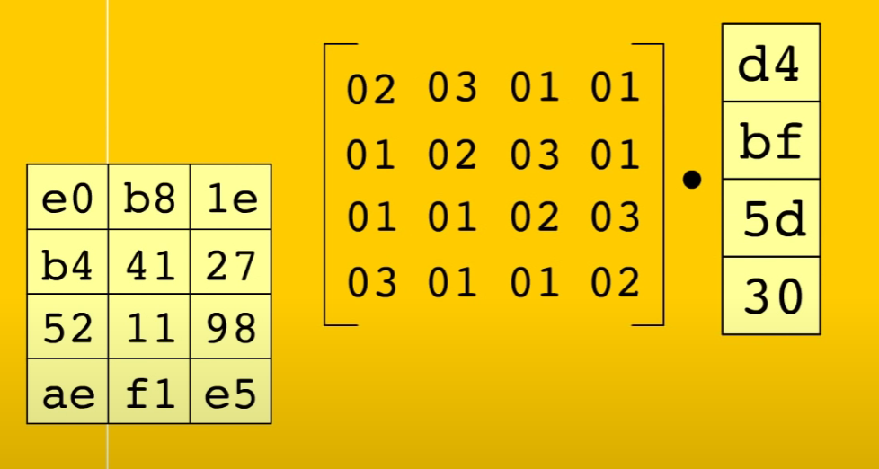
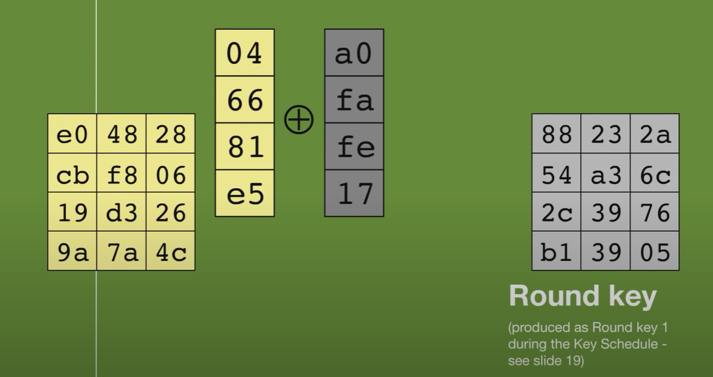
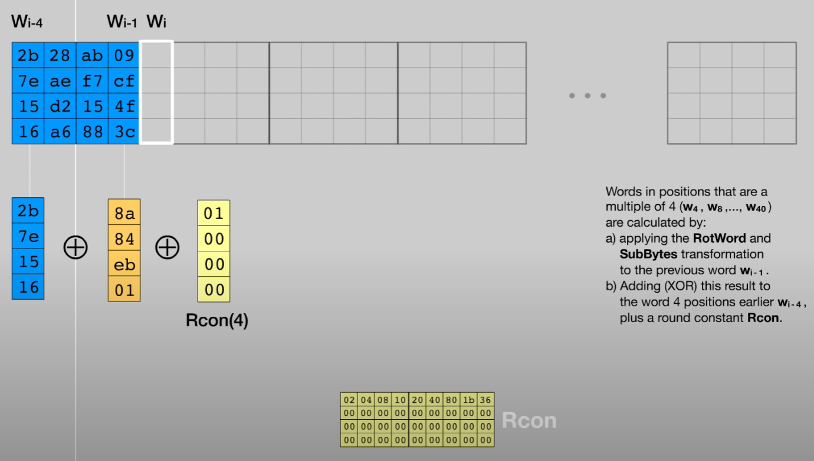

# tse_algo_chiffrement_aes



Cette partie est codée dans le main, avec plainText qui est le message à chiffrer, cipherkey qui est la clé de chiffrement et cipherTexte qui sera le message chiffré.



La boucle est codée dans la fonction Cipher



Cette action est codée dans la fonction SubBytes en faisant appel au tableau statique sbox.



La rotation des lignes est gérée dans la fonction ShifRows



La multiplication des colonnes est geré par la fonction MixColumn



L'addition de la clé au message est faite dans la fonction AddRoundKey



La modification de la clé à chaque itération de AddRoundKey, normalement dans la fonction RotWord, je n'ai pas réussi à coder cette partie.


J'ai posé les bases pour faire en sorte que le programme puisse fonctionner en AES 192 & 256 avec ces definitions :
```
#define AES128 1

//Definition des valeur de Nk Nb Nr en fonction du mode d'execution dans le header
#if defined(AES256) && (AES256 == 1)
#define Nk 8
#define Nb 4
#define Nr 14
#elif defined(AES192) && (AES192 == 1)
#define Nk 6
#define Nb 4
#define Nr 12
#else
#define Nk 4 //AES 128
#define Nb 4
#define Nr 10
#endif
```